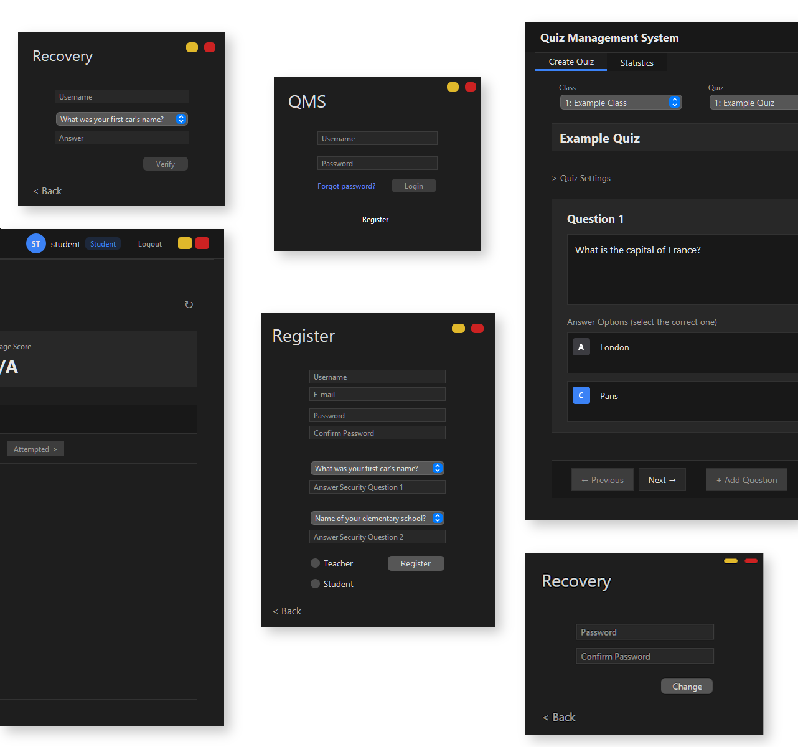

<p align="center">
  
  
  
  <br/>
  
  
  
</p>

<h1 align="center">Quiz Management System</h1>

<p align="center">
  A desktop application for creating, managing, and taking quizzes<br/>
  with role-based portals for teachers and students.
</p>

<p align="center">
  
</p>


<div align="center">
<table>
<tr>
<td width="50%">

### Teacher Portal
- Create MCQ quizzes with multiple questions
- Set time limits and submission deadlines
- Assign quizzes to specific classes
- View detailed attempt statistics
- Track student performance across quizzes

</td>
<td width="50%">

### Student Portal
- Dashboard with available quizzes
- Timed quiz attempts with countdown
- Automatic submission on timeout
- View results after deadline passes
- Performance statistics and history

</td>
</tr>
</table>
</div>

<h3 align="center">Core Capabilities</h3>

<div align="center">

| Feature | Description |
|---------|-------------|
| Role-Based Access | Separate authentication and interfaces for teachers and students |
| Secure Passwords | SHA-256 hashing with random salt, security questions for recovery |
| Connection Pooling | HikariCP for efficient database connection management |
| Modern UI | FlatLaf dark theme with custom components |

</div>

<br/>

## Installation

### Prerequisites

| Requirement | Version |
|-------------|---------|
| Java JDK | 17 or higher |
| MySQL Server | 8.0+ |
| Apache Ant | 1.10+ (or NetBeans IDE) |

### Database Setup

1. Run the schema script to create the database:
   ```bash
   mysql -u root -p < database/schema.sql
   ```

2. Update `src/config.properties` with your database credentials:
   ```properties
   db.url=jdbc:mysql://localhost:3306/quiz_management
   db.user=root
   db.password=yourpassword
   ```

### Build & Run

<table>
<tr>
<td>

**NetBeans IDE**
1. Open the project folder
2. Right-click project → *Clean and Build*
3. Right-click project → *Run*

</td>
<td>

**Command Line**
```bash
ant clean jar
java -jar dist/QuizSystem.jar
```

</td>
</tr>
</table>

<br/>

## Project Structure

```
QuizSystem/
├── src/com/quizmanagement/
│   ├── db/                  # Data Access Objects
│   │   ├── DBConnection     # HikariCP connection pool
│   │   ├── QuizDAO          # Quiz CRUD operations
│   │   └── UserDAO          # User authentication
│   ├── main/                # Application entry
│   ├── objs/                # Domain models
│   │   ├── User, Quiz, Question, ClassObj
│   │   └── MCQQuestion
│   ├── ui/                  # Swing components
│   │   ├── LoginFrame       # Authentication
│   │   ├── student/         # Student portal
│   │   └── teacher/         # Teacher portal
│   └── util/                # Utilities
│       ├── PasswordUtils    # Hashing & verification
│       └── ConfigLoader     # Properties loader
├── database/
│   └── schema.sql           # Database setup script
├── libs/                    # JAR dependencies
└── nbproject/               # NetBeans configuration
```

<br/>

## Dependencies

| Library | Version | Purpose |
|:--------|:-------:|:--------|
| FlatLaf | 3.5.4 | Modern look and feel with dark theme |
| MySQL Connector/J | 9.1.0 | JDBC driver for MySQL |
| HikariCP | 5.1.0 | High-performance connection pooling |
| LGoodDatePicker | 11.2.1 | Date and time picker components |
| SLF4J Simple | 2.0.9 | Logging facade and implementation |
| JNA Platform | 5.15.0 | Native system integration |

<br/>

## Configuration

Default settings in `config.properties`:

| Property | Default | Description |
|----------|---------|-------------|
| `db.url` | `localhost:3306` | MySQL server address |
| `db.name` | `quiz_management` | Database name |
| `db.pool.size` | `10` | HikariCP max connections |

<br/>

## Notes

- Quiz results remain hidden from students until the deadline passes
- Passwords use SHA-256 with 16-byte random salt
- Failed login attempts are logged via SLF4J
- Window is undecorated with custom title bar controls

---

<p align="center">
  <sub>Semester Project - QMS in Java</sub>
  <br/>
  <sub>Fall 2024</sub>
</p>
